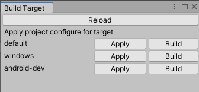

# Build Profile
helper for config build profile in and outside unity ecosystem

[](https://openupm.com/packages/me.freetale.unity.builder/)


# Feature
- [x] In Unity Support
- [ ] Command line support
- [ ] Ci environment support
- [x] build from outside unity
- [ ] yaml support

- [x] unity project wide configuration
- [x] support openupm
- [ ] support bash script
- [ ] example for all platform
- [x] leave no trace in build

# Installation

## 1.a via package.json

insert dependencies to Packages/manifest.json
```json
{
  "dependencies": {
    ...
    "me.freetale.unity.builder": "https://github.com/freetale/me.freetale.unity.builder.git?path=Assets/me.freetale.unity.builder"
  }
}
```

## 1.b via openupm

```
openupm add me.freetale.unity.builder
```
## 2. Enable profile
add this to script define symbols
- `FTBUILDER_JSON`
- `FTBUILDER_YAML`

# Usage

Create file `BuildConfig.json` in project root
```json
{
  "Targets": [
    {
      "Name": "default",
      "BuildPlayerOptions": {
        "LocationPathName": "Builds/windows/windows.exe",
        "Target": "StandaloneWindows",
        "TargetGroup": "Standalone",
        "ExtraScriptingDefines": [
          "DEFINE_A",
          "DEFINE_B"
        ]
      },
      "StaticProperties": {
        "UnityEditor.PlayerSettings,UnityEditor": {
          "bundleVersion": "0.2"
        }
      }
    }
  ]
}
```
### build outside unity with Powershell
```ps1
$UNITY_EDITOR_PATH="C:/Program Files/Unity/2019.4.24f1/Editor/Unity.exe" #(Require) Path to unity installation
$BUILD_TARGET="Standalone" #(Recommend) unity startup build target, https://docs.unity3d.com/Manual/CommandLineArguments.html
$PROJECT_PATH=${PWD} #(Optional) default to ${PWD}
$TARGET="default" # target to build, default to "default"
./Library/PackageCache/me.freetale.unity.builder@1.0.0/Script/lib.ps1 # may change by version number
```
### set profile inside unity

see __Window > Build Profile__



# Commandline
must in form
`--<command>=<value>` otherwise it will not read by reader.
`config` config definition to use. default to `BuildConfig.json`
`target` target to build. default to `default`
`set` apply json value, before parse json as target level. can be set multiple times
# Configuration
BuildConfig.json require only Target[] object. ignore all token doesnot match.

### Targets
list of define target, when build we need choose one from this list. each target contains 4 fields.
- `Name` name of target we select from script
- `BuildPlayerOptions` options pass to `BuildPlayerPipeline` [referance](https://docs.unity3d.com/ScriptReference/BuildPlayerOptions.html)
- `StaticProperties` static property need to set before build, see below for more info
- `ScriptingDefineSymbols` list of define directive as string
> :warning: Store password in plain text is insecure.
#### StaticProperties
static property need to set before build, like `PlayerSettings.keystorePass` which does not remember by unity, name must be [AssemblyQualifiedName](https://docs.microsoft.com/en-us/dotnet/api/system.type.assemblyqualifiedname?view=net-5.0#System_Type_AssemblyQualifiedName) like `UnityEditor.PlayerSettings+Android,UnityEditor`
if first type search not found. it try auto appead `UnityEditor` namespace and assembly. it helpful for more pretty type search

# Apply Target config

GUI Locate in unity editor
Window > Build Target

if hit on target button, it will apply to project. useful for debigging.
